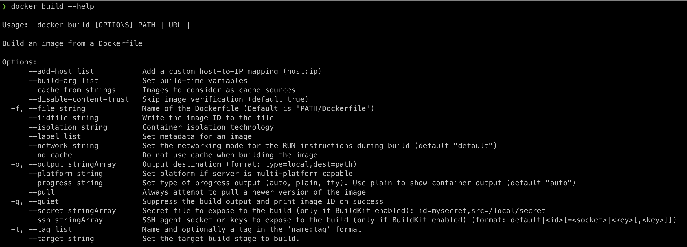

# <span style="color:aqua"> Data Engineering ZoomCamp 2023 Week One Homework</span>

## Question 1: Knowing docker tags
Run the command to get information on Docker

docker --help

Now run the command to get help on the "docker build" command

Which tag has the following text? - Write the image ID to the file

idfile string




##  Question 2: Understanding docker first run 
Run docker with the python:3.9 image in an interactive mode and the entrypoint of bash. Now check the python modules that are installed ( use pip list). How many python packages/modules are installed?

3


 
##  Question 3: Count records
How many taxi trips were totally made on January 15?
Tip: started and finished on 2019-01-15.
Remember that lpep_pickup_datetime and lpep_dropoff_datetime columns are in the format timestamp (date and hour+min+sec) and not in date.

20530

```sql
SELECT COUNT(1)
FROM green_taxi_trips
WHERE DATE(lpep_pickup_datetime) = '2019-01-15'
    AND DATE(lpep_dropoff_datetime) = '2019-01-15';
```


## Question 4. Largest trip for each day
Which was the day with the largest trip distance Use the pick up time for your calculations.

2019-01-15

```
WITH maks_distance_day AS (SELECT DATE(lpep_pickup_datetime) AS day,
                                  MAX(trip_distance)            max_trip_for_day
                           FROM green_taxi_trips
                           GROUP BY DATE(lpep_pickup_datetime)
                           ORDER BY max_trip_for_day DESC
                           LIMIT 1
                           )
SELECT day
FROM maks_distance_day;
```

## Question 5. The number of passengers
In 2019-01-01 how many trips had 2 and 3 passengers?

2: 1282 ; 3: 254

```
SELECT passenger_count,
       COUNT(1)
FROM green_taxi_trips
WHERE DATE(lpep_pickup_datetime) = '2019-01-01'
    AND passenger_count IN (2, 3)
GROUP BY passenger_count
```

## Question 6. Largest tip
For the passengers picked up in the Astoria Zone which was the drop off zone that had the largest tip? We want the name of the zone, not the id.
Note: it's not a typo, it's tip , not trip

Long Island City/Queens Plaza

```
WITH astoria_zone_id AS (SELECT "LocationID"
                         FROM taxi_zone
                         WHERE "Zone" = 'Astoria'
                         ),

    maks_tip_trip_id AS (SELECT "DOLocationID"
                         FROM green_taxi_trips gtt
                         WHERE gtt."PULocationID" = (SELECT * FROM astoria_zone_id)
                         ORDER BY tip_amount DESC
                         LIMIT 1
                         )

SELECT "Zone"
FROM taxi_zone
WHERE "LocationID" = (SELECT * FROM maks_tip_trip_id)
```


## terraform apply
```
Terraform used the selected providers to generate the following execution plan. Resource actions are indicated with the following symbols:
  + create

Terraform will perform the following actions:

  ### google_bigquery_dataset.dataset will be created
  + resource "google_bigquery_dataset" "dataset" {
      + creation_time              = (known after apply)
      + dataset_id                 = "trips_data_all"
      + delete_contents_on_destroy = false
      + etag                       = (known after apply)
      + id                         = (known after apply)
      + labels                     = (known after apply)
      + last_modified_time         = (known after apply)
      + location                   = "europe-west6"
      + project                    = "dataengzoomcamp2023"
      + self_link                  = (known after apply)

      + access {
          + domain         = (known after apply)
          + group_by_email = (known after apply)
          + role           = (known after apply)
          + special_group  = (known after apply)
          + user_by_email  = (known after apply)

          + dataset {
              + target_types = (known after apply)

              + dataset {
                  + dataset_id = (known after apply)
                  + project_id = (known after apply)
                }
            }

          + routine {
              + dataset_id = (known after apply)
              + project_id = (known after apply)
              + routine_id = (known after apply)
            }

          + view {
              + dataset_id = (known after apply)
              + project_id = (known after apply)
              + table_id   = (known after apply)
            }
        }
    }

  ### google_storage_bucket.data-lake-bucket will be created
  + resource "google_storage_bucket" "data-lake-bucket" {
      + force_destroy               = true
      + id                          = (known after apply)
      + location                    = "EUROPE-WEST6"
      + name                        = "dtc_data_lake_dataengzoomcamp2023"
      + project                     = (known after apply)
      + public_access_prevention    = (known after apply)
      + self_link                   = (known after apply)
      + storage_class               = "STANDARD"
      + uniform_bucket_level_access = true
      + url                         = (known after apply)

      + lifecycle_rule {
          + action {
              + type = "Delete"
            }

          + condition {
              + age                   = 30
              + matches_prefix        = []
              + matches_storage_class = []
              + matches_suffix        = []
              + with_state            = (known after apply)
            }
        }

      + versioning {
          + enabled = true
        }

      + website {
          + main_page_suffix = (known after apply)
          + not_found_page   = (known after apply)
        }
    }

Plan: 2 to add, 0 to change, 0 to destroy.
```
